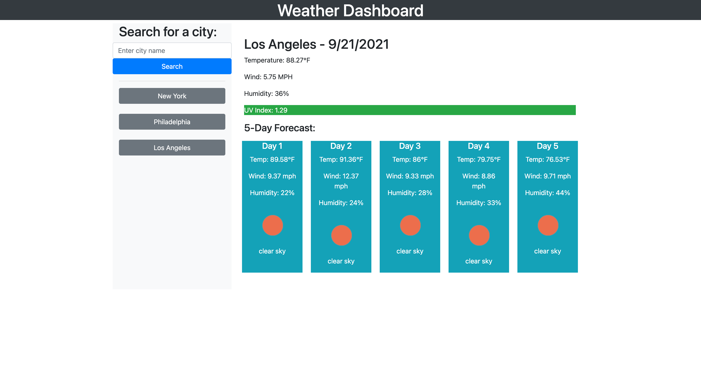

# weather-dashboard

This is an application that calls the current weather and 5-day forecast of any city entered. The app incorporates jQuery, Bootstrap, and the [OpenWeather API](https://openweathermap.org/api/one-call-api).

## Table of Contents

- [Installation](#installation)
- [Usage](#usage)
- [Credits](#credits)
- [License](#license)

## Installation

To run a copy of this app on your local machine, first clone the repository:

HTTPS:

```
$ git clone https://github.com/liaobrien/weather-dashboard.git
```

SSH:

```
$ git clone git@github.com:liaobrien/weather-dashboard.git
```

Then cd into the directory into which you cloned, right-click on index.html, and choose "Open in default browser."

## Usage

This page can be accessed and used on any standard web browser. The user first enters the name of the city they want to receive weather data from. After clicking "Search", the current temperature, wind speed, humidity, and UV index of the city are displayed at the top, and the forecast for the next 5 days are displayed below. A sidebar of all the user's past searches also accumulates, and the user can click on any of those buttons to re-render the weather for that city.

## Credits

I'd like to give a huge shoutout to my coding bootcamp cohort-mate Andrew Currie for offering assistance on building this application. All his work can be found at [https://github.com/curriecoder](https://github.com/curriecoder).

## License

Creative Commons License: This work can be used by others as long as credit is given.



The application can be viewed here: [https://liaobrien.github.io/weather-dashboard/](https://liaobrien.github.io/weather-dashboard).
